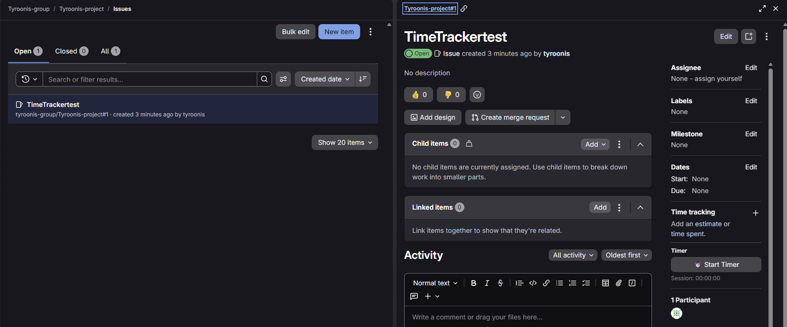
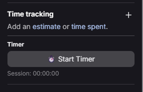

# GitLab Issue TimeTracker

**GitLab Issue TimeTracker** is a lightweight userscript that adds a Start/Stop timer directly into the GitLab issue sidebar (Time Tracking section).  
It automatically logs "Spent Time" via the GitLab API and works seamlessly with both the **classic issue view** and the **new GitLab Quick View panel**.

---

## Features

- **Start/Stop Timer** per issue  
- **Session tracking persists** across navigation  
- **Automatically logs spent time** using GitLab’s `add_spent_time` API  
- Supports:
  - Issue detail pages  
  - Quick View panel (`?show=...`)  
- Compatible with:
  - Tampermonkey  
  - Violentmonkey  
- Auto-update ready for GitHub hosting  
- Local token storage via Tampermonkey  
- UI blends perfectly with GitLab's sidebar  

## Screenshots

---

## Installation

### 1. Install a Userscript Manager

- **Tampermonkey**  
  https://www.tampermonkey.net/
- **Violentmonkey**  
  https://violentmonkey.github.io/

### 2. Install the Script

https://raw.githubusercontent.com/Tyroonis/GitLab-Issue-TimeTracker/main/gitlab-issue-timer.user.js

### 3. Enter Your GitLab API Token

On first run, the script will prompt for a Personal Access Token with:

- **Scope:** `api`

The token is saved securely in Tampermonkey's storage.

---

## How It Works

1. The script detects the current issue (page or Quick View).  
2. Injects a timer UI into the **Time Tracking** sidebar section.  
3. **Start Timer**:
   - Begins a session  
   - Saves state per issue  
4. **Stop Timer**:
   - Ends the session  
   - Calculates time spent  
   - Automatically sends it to GitLab  
5. Works seamlessly even when GitLab dynamically updates the sidebar (SPA).

---

## Configuration

Editable directly in the script:

- GitLab instance URL (`https://gitlab.example.com`)
- Minimum time before logging (default: **30 seconds**)
- Text labels or styling

---

## Security Notice

- Your GitLab token **never leaves your machine**  
- Stored via Tampermonkey secure storage  
- Script only matches GitLab issue URLs:
  https://gitlab.example.com/*/-/issues

No external scripts or third-party dependencies are used.

---

## Compatibility

Tested with:

- GitLab 16–18 (Self-Managed EE/CE)
- GitLab Cloud
- Chrome, Firefox, Edge  
- Tampermonkey 5.x  
- Violentmonkey 2.x  

---

## Auto-Update Integration

@downloadURL https://raw.githubusercontent.com/Tyroonis/GitLab-Issue-TimeTracker/main/gitlab-issue-timer.user.js

@updateURL https://raw.githubusercontent.com/Tyroonis/GitLab-Issue-TimeTracker/main/gitlab-issue-timer.user.js

---

## License

This project is open-source and licensed under the **MIT License**.

